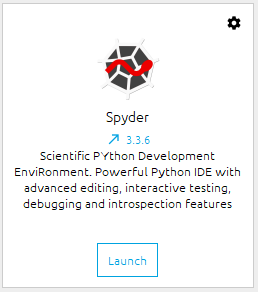

# Python简介、下载与安装

## Python简介

[Python](https://www.python.org/)官方网站对Python的定义是“Python is a programming language that lets you work more quickly and integrate your systems more effectively.”，说明Python是一种可以提高工作效率并高效整和你的系统的一种编程语言，它主要有两个特点：

1. 提高工作效率
- Python语法简单，优雅，符合英语的习惯；
- 相比C++等高级语言，Python对编程基础要求不高；
2. 高效整和系统
- 这里的系统可以理解为工作流程，或者工作中需要用到的各类软件，或者在电脑上的各种操作（建立文件夹等）；
- Python可以方便地调用系统命令，批量创建文件和文件夹等；
- Python可以作为中枢对数据进行处理，并在各类程序或软件之间进行数据传递。

Python的历史没有很长，在这里不会过多陈述，感兴趣的可以自行搜索。

## Python下载与安装（Anaconda）

Python再简单也需要一个工具来编写并运行它，集成开发环境 (IDE) 就是这样一种工具。在IDE里你可以编写、运行、调试你的程序，甚至进行版本控制。本教程旨在让初学者尽快上手，所以我们只使用Anaconda，并使用其自带的Spyder软件进行Python代码的编写和运行。

[Anaconda](https://www.anaconda.com/)是一个免费开源的Python和R语言的发行版本，用于计算科学（数据科学、机器学习、大数据处理和预测分析）[[1]](https://zh.wikipedia.org/wiki/Anaconda_(Python%E5%8F%91%E8%A1%8C%E7%89%88))。Anaconda里内置了Python解释器，所以我们无需额外安装Python。

1. 点击进入Anaconda官方主页https://www.anaconda.com/
2. 依次点击Products -> Individual Edition -> Download -> 选择与自己系统匹配的版本下载，我使用的是Windows 64位版本
3. 安装时注意一下安装路径，其他的默认就可

## Hello Python World

下面使用Anaconda自带的集成开发环境Spyder来编写第一个程序。

首先打开Anaconda Navigator，点击Spyeder下面的Launch。



打开Spyder后，可以看到一个编写代码的页面，在这里输入如下代码：
```Python
print('Hello Python world!')
```
> 大家需要注意一下输入法的问题，Python中的逗号，括号等符号需要在英文输入法下输入，使用中文的会报错。
这段代码的功能是在终端中打印输出“Hello Python world!”的命令。

输入完毕后点击上面的执行按钮，在右下角就可以看到我们的输出结果啦！


> **说明**：我们可以看到此时的文件名是temp.py，其中`.py`指Python文件，`temp`是文件名，由于我们未指定文件名，这里采用的默认的文件名。可以通过保存或者另存为修改文件名。


